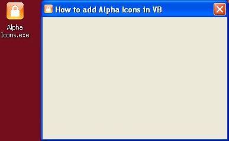



## How to add Alpha Icons to VB Projects\!

### Description

Have you ever wanted to add Alpha Icons to your Visual Basic Projects, but with the limitations of Visual Basic been unable?

Well here's how to do it easily!

PS. To use this you must first complie the project before you can see the Alpha Icons, they will not be visible at Design Time!!!
 
### More Info
 

             |
---                |---
**Submitted On**   |2011-02-17 04:50:02
**By**             |[Xander75](https://github.com/Planet-Source-Code/PSCIndex/blob/master/ByAuthor/xander75.md)
**Level**          |Beginner
**User Rating**    |5.0 (15 globes from 3 users)
**Compatibility**  |VB 6\.0
**Category**       |[Miscellaneous](https://github.com/Planet-Source-Code/PSCIndex/blob/master/ByCategory/miscellaneous__1-1.md)
**World**          |[Visual Basic](https://github.com/Planet-Source-Code/PSCIndex/blob/master/ByWorld/visual-basic.md)
**Archive File**   |[How\_to\_add2198252172011\.zip](https://github.com/Planet-Source-Code/xander75-how-to-add-alpha-icons-to-vb-projects__1-73752/archive/master.zip)

